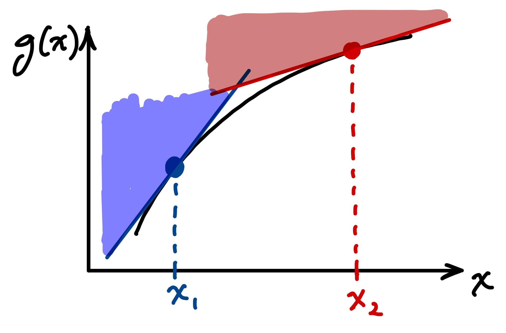

# Component Reliability Analysis

_This solution refers to specific Tasks in the notebook `Analysis_Solution.ipynb`._

Complete the tasks in `Analysis.ipynb` then answer the following questions.

**Question 1:** Describe the component reliability analysis, making sure to identify the 5 key ingredients (outlined in the lecture and [here](https://teachbooks.github.io/HOS-workbook/2024/component/overview.html)):

We were provided a limit-state function, $g_X(x)$ that defined stability of a beam due to 3 loads: two moments and an axial force. The resistance of the beam is defined by $Y$. These are the four random variables that make $g_X(x)$ our function of random variables. There are also 3 deterministic parameters.

A marginal distribution is provided for each random variable (2 are Gaussian). For part of the analysis we assume the variables are independent; comparing results of MCF and FORM later will indicate that the effect of dependence is small (at least smaller than the effect of FORM versus the linearized approach with expansion point at the mean values of the random variables; see questions 5 and 6, below).

The limit-state function defines the 3rd and 4th "key ingredients" (function of random variables and region of interest); by convention the region of interest is defined as the condition where $g_X(x)<0$.

The final ingredient is the algorithm for finding $p_f$, and we use three:
- linearizing the LSF at the mean values of the random variables and evaluating $P[g_X(x)<0]$ using the Normal distribution
- Monte Carlo Simulation
- First-Order Reliability Method (FORM)

_Note that explaining this to a fellow student from memory would be good oral exam practice._

**Question 2:** The notebook guided you through three component reliability algorithms. Describe the differences in approach.

Monte Carlo Simulation (MCS) is based on taking a sample from the multivariate distribution and estimating the failure probability as the fraction of the total number of realizations when $g_X(x)<0$.

The other two methods are different from MCS as they rely on a linear approximation of the limit-state function. The first method linearizes the LSF using the mean point as the expansion point, whereas the First-Order Reliability Method (FORM) uses a different expansion point, defined by the design point. We were not told much about the design point in the assignment (especially how it is found), but it appears to be located on the limit-state surface. Thus, the main difference between the two linearization method seems to be that FORM approximates the function closer to the failure region of the component (i.e., it is looking more at the "tails" of the multivariate distribution).

**Question 3:** State the calculated failure probability for each of the methods used.

| Method | Independent ($\rho=0$) | Independent ($\rho=0.5$) |
| :---: | :---: | :---: |
| MCS | 0.0051 | 0.0070 |
| FORM | 0.0033 | 0.0044 |
| Linear Model | 2.45e-5 | N/A |

**Question 4:** Which random variables have the biggest influence on the calculated failure probability? Justify your answer quantitatively.

_Hint: using the terms in the approximated variance equation can be useful._

_Note: more information is provided here than you were expected to write. The additional results give insight into the subject of questions 5 and 6._

It is easiest to consider the gradient of the LSF, where we can see that $M_1$ and $M_2$ have the biggest effect (i.e., biggest change in the LSF given a unit change in the random variable). However, we should also take into account the variability of each random variable; this is easily done using the term $\sigma^2 (\partial g / \partial X_i)^2$. It provides a normalized incremental change in the LSF (i.e., $\Delta g$) and it is also a key term in the computation of the variance of the LSF. As shown in the table below, the values for all random variables have similar order of magnitude, which means that they all have roughly equal contribution to the failure probability. In other words, the variability of $P$ and $Y$ (the stochastic response) make up for the smaller mechanical response (partial derivatives), relative to $M_1$ and $M_2$.

The table also illustrates how the interpretation is dependent on the linearization point: when linearized at the design point, $x^*$, random variables $P$ and $Y$ have a clearly dominant effect, compared to the other two variables. This can be again explained by the role of "uncertainty:" the variability in $P$ and $Y$ have a larger impact than $M_1$ and $M_2$, as described in the paragraph above; however, $P$ and $Y$ have an even larger influence in the failure region. 

| Variable | $\sigma^2$ | $(\partial g / \partial X_i)^2$ | at $\mu_X$: $\sigma^2 ( \partial g / \partial X_i)^2$ | at $x^*$: $\sigma^2 (\partial g / \partial X_i)^2$ |
| :---: | :---: | :---: | :---: | :---: |
| $M_2$ | 1.41e+03 | -8.33e-04 | 3.906e-03 | 7.486e-03 |
| $M_1$ | 5.62e+03 | -1.67e-03 | 3.906e-03 | 7.486e-03 |
| $P  $ | 2.50e+05 | -8.66e-05 | 1.873e-03 | 1.002e-02 |
| $Y  $ | 1.60e+07 | +1.58e-05 | 4.008e-03 | 3.248e-02 |

It is also worth noting how the linearization point influences the estimated variance and standard deviation of the limit state function, as well as the estimated probability. Note that the probability computed in the table below is slightly different from the value computed for FORM using OpenTURNs.

| Linearization Point | $\sigma_{g_X(x)}^2$ | $\sigma_{g_X(x)}$ | $-\mu_{g_X(x)}/\sigma_{g_X(x)}$ | $p_f=\Phi[-\mu_{g_X(x)}/\sigma_{g_X(x)}]$ |
| :---: | :---: | :---: | :---: | :---: |
| $\mu_{g_X(x)}$ | 1.37e-02 | 1.17e-01 | -4.061 | 2.45e-5 |
| $x^*$ | 5.75e-02 | 2.40e-01 | -1.980 | 2.39e-2 |

Recall the mean of the LSF is $\mu_{g_X(x)}=g_X(\mu_X)$=4.751e-1.

**Question 5:** The notebook asked you to consider two linearized approximations of the function of random variables. What was the difference between these two approaches?

The primary difference is in the linearization point (expantion point from Taylor Series) used in the linear approximation of the limit state function.

**Question 6:** Why do you think the FORM approach produces such a different failure probability than the MUDE linearization approach?

The reason the computed failure probabilities are different is that the linearized LSF are different, due to the expansion points. The sketch below illustrates how the linearization point can dramatically change the linearized function; although illustrated for a 1D case, the illustration can be extended to multiple dimensions. The reason that this influences failure probably is obvious if one recalls that to find $p_f$ we are integrating the multiviariate probability _density_ function over a region of interest that is defined by the function. In other words, integrating over a region indicated by the shaded zones in the sketch, which are clearly different.

